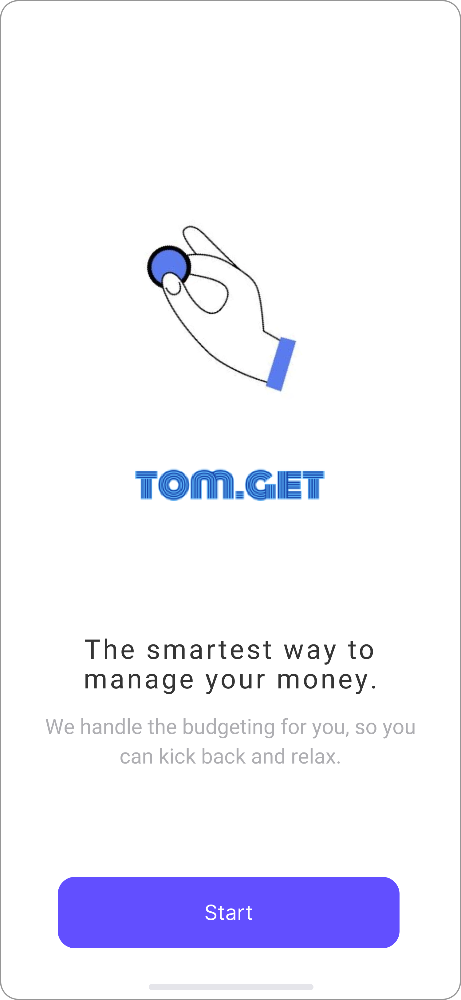
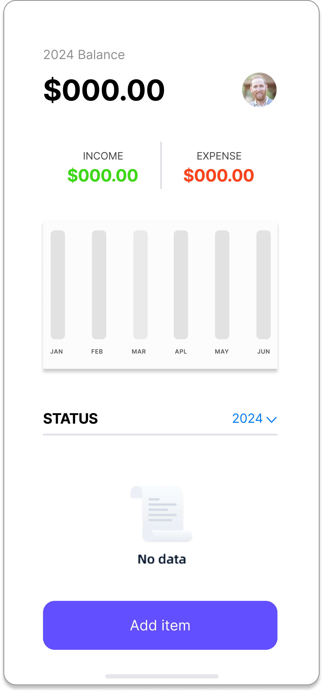
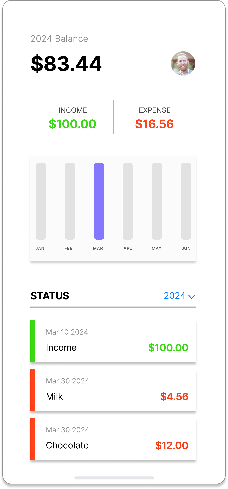
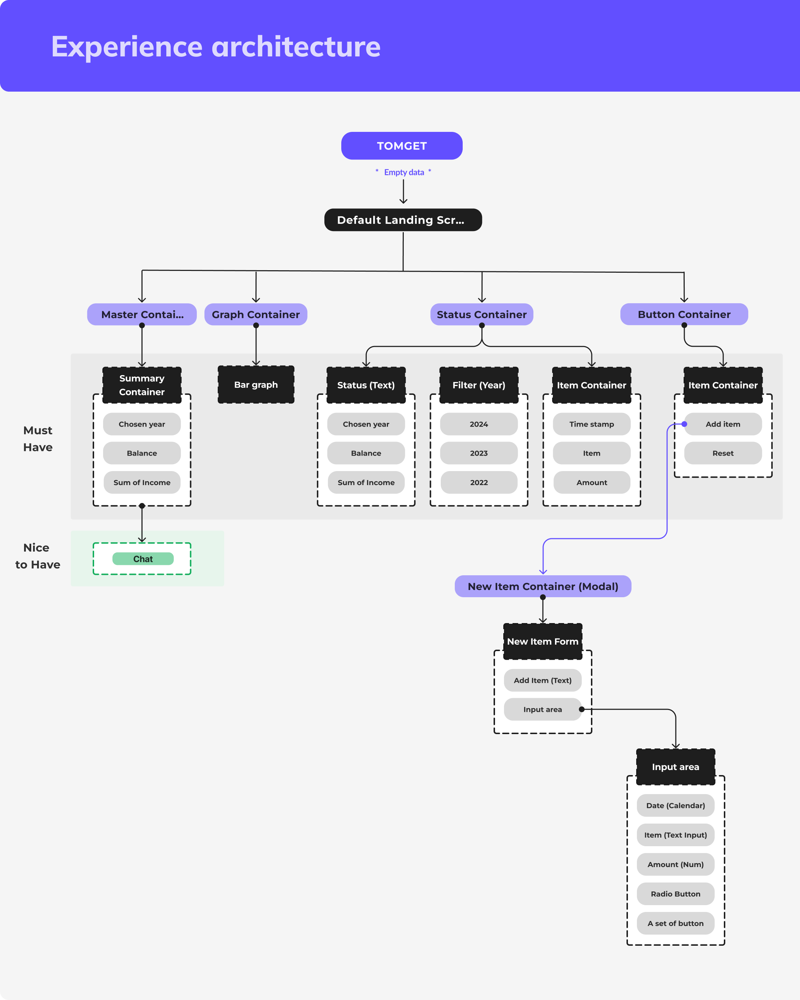
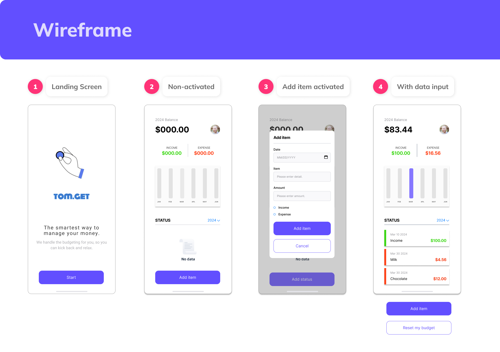

<h2 align="center">
  SBA_316_the Document Object Model  
</h2>

<h3 align="center">
  TOMGET - Personalized Expense Tracker
</h3>

                    

# Development Time
> **Design Concept and Create Architecture: 2024.03.28. ~ 2024.03.30.**  
> **Computation: 2024.03.30. ~ 2024.04.01.**

## Live Demo

> **First Proto** : [https://hannah-moon.github.io/17_SBA_316_theDocumentObjectModel/)  
> **Rendered Proto** : [) 

## Designer and Developer

|      Hannah Moon       |                                                                                                                        
| :------------------------------------------------------------------------------: |  
|       |  
|   [@Hannah-Moon](https://github.com/Hannah-Moon)   |   

## Project Inspiration

In the midst of my journey to financial independence, Tom emerged as a guiding light to build my financial stability. He stepped in to offer financial counseling. His invaluable support and mentorship helped me to get through rigorous training and navigate financial obstacles on my path to becoming an engineer. Without a doubt, his steadfast encouragement propelled me forward.

I was inspired by his dedication to empowering others, particularly through financial stewardship and dedicated work. To commemorate his support, I designed 'TOMGET'—an AI-backed budgeting app crafted to aid individuals like myself in achieving financial stability and freedom.

'TOMGET' support on a journey of growth and resilience, guided by Tom's wisdom and support.

## Project Overview
### Web Development Tool kits
I used,
---
### Environment

             

### Development

---
## Screen Design 📺
| Loading  |  Default   |
| :-------------------------------------------: | :------------: |
|   |  |  
| Modal   |  Activated  |  
|    |       |

---
## Key Feature 📦

### ⭐️ Auto Caculator 
- Calculate culminated income and expense 
- Calculate real-time balance

### ⭐️ Chart
- Display visually comparable bar chart for each month

### ⭐️ Supporting Aid
- Live agent connection tool 

---
## Design Process 🖌️

### Information Architecture

### Wireframe

---
## Reflection 🔎

| Question   | Answer                            |
| -----------| --------------------------------- | 
| 1. What could you have done differently during the planning stages of your project to make the execution easier? | During planning, too much time was spent on product design to ensure a solid concept, leaving not enough time for coding. This caused delays and may have affected the project's progress. | 
| 2. Were there any requirements that were difficult to implement? What do you think would make them easier to implement in future projects? | Meeting all requirements was tough. But I followed my instructors' advice to focus on making the code work first and then refine it. Breaking tasks into smaller steps helped me reach my goals consistently.|
| 3. What would you add to, or change about your application if given more time? | Time management is really important for getting things done. Looking back, I see that I need to be better at managing my time. I'm going to improve by planning out my time more carefully. This means setting clear schedules for each part of the project, like designing, coding, testing, and making changes. I'll also make sure to be flexible and adjust my plans if needed. With better time management, I believe I can make progress on the project more smoothly. |
| 4. Use this space to make notes for your future self about anything that you think is important to remember about this process, or that may aid you when attempting something similar again? | Let's not get too carried away with big ideas. Remember, you only have two full days to finish these tasks, and you've got other things in your life to handle too. It's important to use your time wisely and stay realistic about what you can achieve. |
